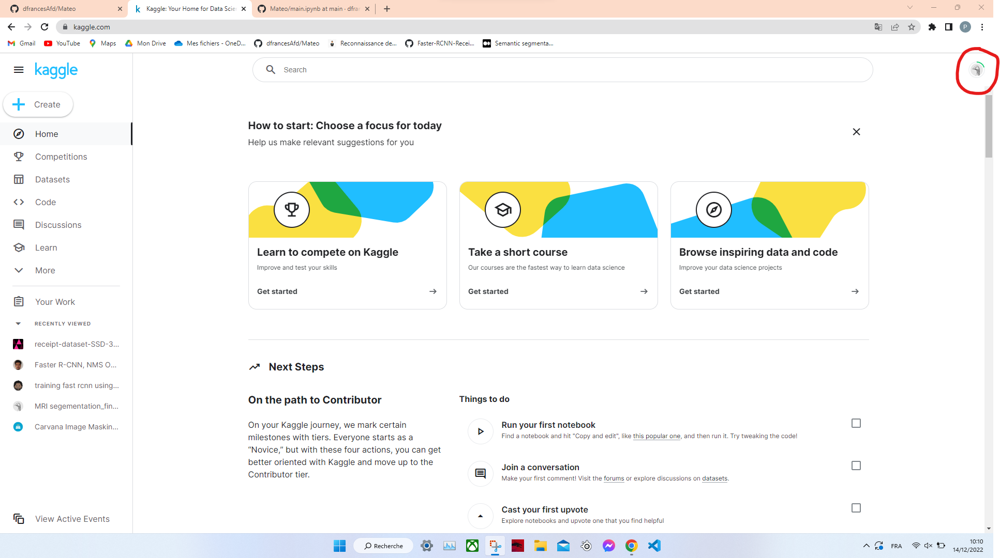
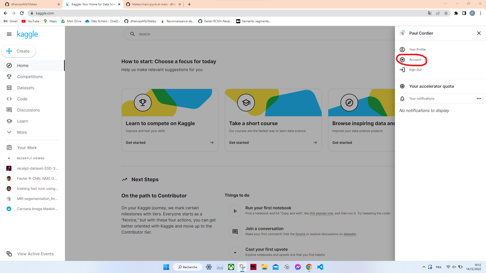
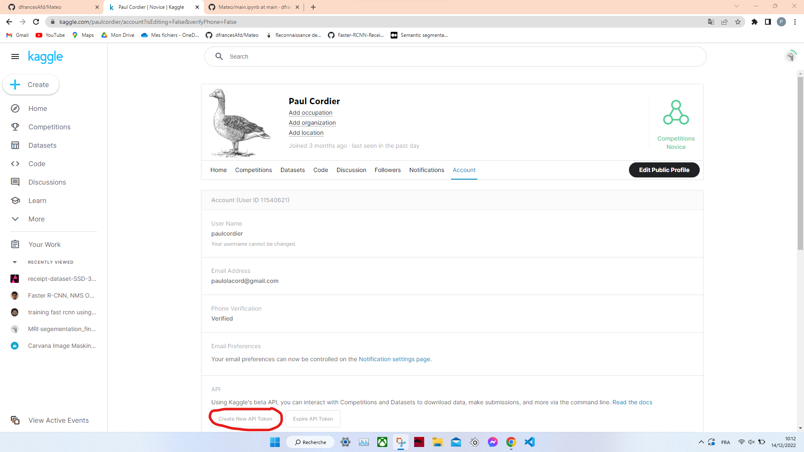
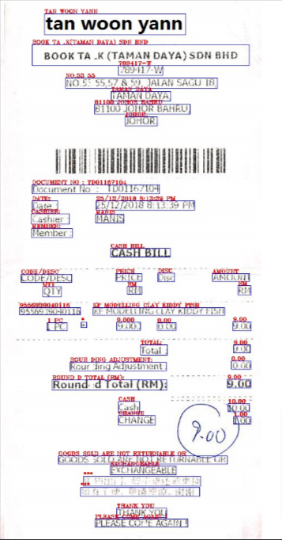
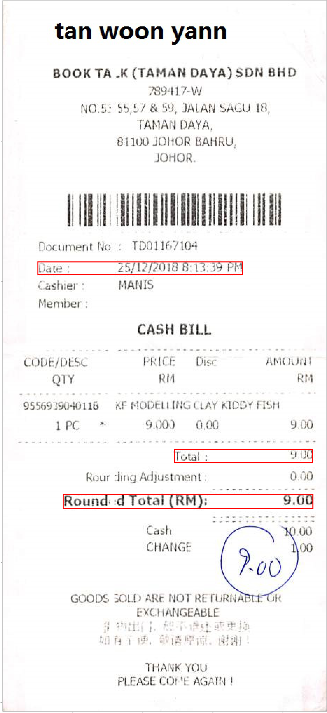

# Lien de la base de données : 

Pour faciliter la tâche, j'ai procédé au téléchargement de la base de données sur Kaggle.

Pour pouvoir télécharger la base de données disponible sur Kaggle, il faut importer le 'New API token' dans l'environnement de travail. Il se trouve sur Kaggle en cliquant sur l'avatar de son profil en haut à droite : 

Il faut ensuite se rendre sur Account :

Puis cliquer sur 'Create New API token' :

Une fois le téléchargement fait, il suiffit de l'importer dans l'environnement de travail et la ligne ! 

    cp kaggle.json ~/.kaggle/ dans 'main.ipynb' 

Cela va permettre de l'incorporer et le téléchargement suivant (de la base de données) pourra avoir lieu. 

(Elle peut être accessible à travers [ce lien](https://www.kaggle.com/datasets/dhiaznaidi/receiptdatasetssd300v2))

La commande pour la télécharger sur colab : 

    kaggle datasets download -d dhiaznaidi/receiptdatasetssd300v2 déjà codé dans 'main.ipynb'

# Présentation : 

Ce fichier a pour but d'expliquer l'intérêt de notre démarche de reformulation de la base de données qu'on a trouvé sur Kaggle et qui faisait partie d'une compétition autour du thème de l'OCR.

Cette base de données est divisée en deux dossiers : train / test où chaque dossier contient 3 sous-dossiers : celui des images / de la sortie de l'OCR pour chaque image et des fichiers json propres à chaque image contenant les informations "clés".

On s'est basé sur cette base pour en créer un nouveau dossier qu'on a appelé Dataset (il se crée en exécutant le code fourni) qui contient cette fois ci le dossier des images, celui des json contenant les informations clés et un autre dossier créé de notre part qui contient les informations sur chaque image et son avantage majeur c'est qu'il ne fournit que les données nécessaires à notre traitement et leurs boîtes englobantes (bounding boxes) labélisés comme suit : 
* 0 : background
* 1 : total
* 2 : date 

Les informations qu'on a créé se retrouvent sous la forme d'un json file.

Pour mieux voir l'utilité de notre démarche, voici une photo qui est présente sur la base de données de départ. En utilisant les informations fournies et en la visualisant, on obtient une figure similaire à celle là : 

On voit bien qu'il y a trop d'informations englobées, ce qui n'est pas bénéfique pour notre algorithme d'entraînement. On ajoute à ça que les mots total et date sont séparées de leurs valeurs clés et donc impossible de reconnaître le montant en regardant qu'une suite de chiffre.

Néanmoins, on a travaillé à surmonter ce problème et dans la nouvelle Dataset qu'on a créé à partir de celle là, voici la figure de la même facture qu'on obtient n utilisant les informations fournies et en la visualisant :

 

Voici un aperçu pour cet exemple qui s'applique à toutes les autres données : 

    {
    "image_path": "/content/fullDataset/images/000.jpg",
    "image_size": [
        463,
        1013
    ],
    "info_json_path": "/content/fullDataset/info_data/000.json",
    "important_words": [
        {
            "words": [
                {
                    "Coordinates": {
                        "xmin": 50,
                        "ymin": 372,
                        "xmax": 96,
                        "ymax": 390
                    },
                    "Text": "DATE:"
                },
                {
                    "Coordinates": {
                        "xmin": 165,
                        "ymin": 372,
                        "xmax": 342,
                        "ymax": 389
                    },
                    "Text": "25/12/2018 8:13:39 PM"
                }
            ],
            "label": "date"
        },
        {
            "words": [
                {
                    "Coordinates": {
                        "xmin": 245,
                        "ymin": 639,
                        "xmax": 293,
                        "ymax": 658
                    },
                    "Text": "TOTAL:"
                },
                {
                    "Coordinates": {
                        "xmin": 412,
                        "ymin": 639,
                        "xmax": 442,
                        "ymax": 654
                    },
                    "Text": "9.00"
                }
            ],
            "label": "total"
        },
        {
            "words": [
                {
                    "Coordinates": {
                        "xmin": 86,
                        "ymin": 704,
                        "xmax": 292,
                        "ymax": 723
                    },
                    "Text": "ROUND D TOTAL (RM):"
                },
                {
                    "Coordinates": {
                        "xmin": 401,
                        "ymin": 703,
                        "xmax": 443,
                        "ymax": 719
                    },
                    "Text": "9.00"
                }
            ],
            "label": "total"
        }
    ],
    "total": [
        {
            "xmin": 245,
            "ymin": 639,
            "xmax": 442,
            "ymax": 658
        },
        {
            "xmin": 86,
            "ymin": 703,
            "xmax": 443,
            "ymax": 723
        }
    ],
    "date": {
        "xmin": 50,
        "ymin": 372,
        "xmax": 342,
        "ymax": 390
    },
    "roi": {
        "xmin": 17,
        "ymin": 5,
        "xmax": 453,
        "ymax": 997
    },
    "roi_size": [
        436,
        992
    ]
    }
